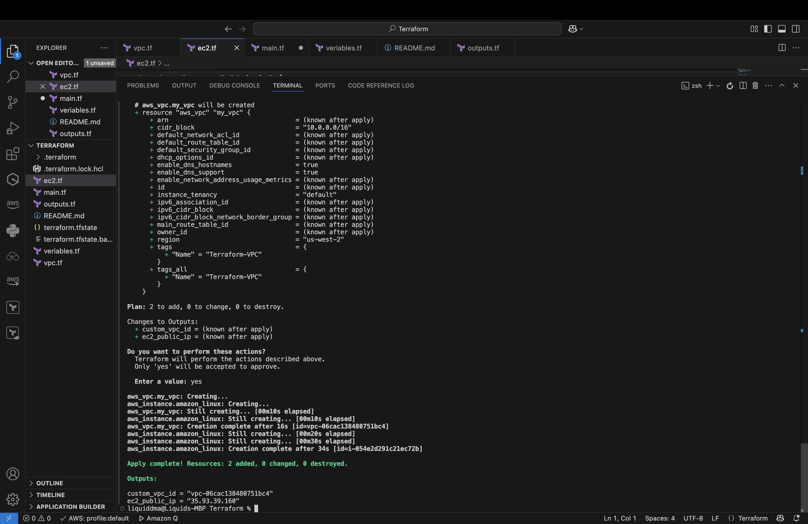
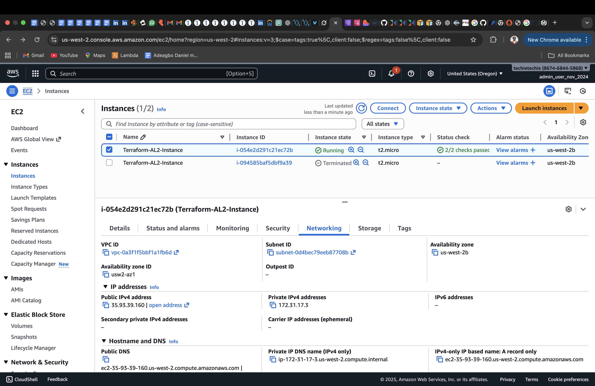
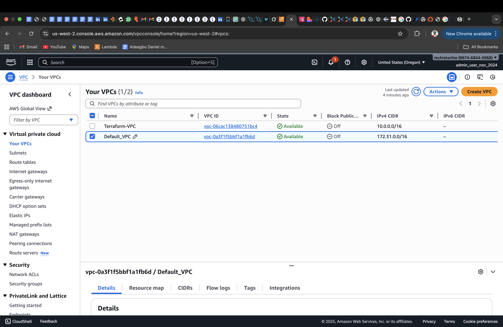

# Terraform Project – VPC & EC2 (us-west-2)
 
# This project uses **Terraform** to deploy AWS infrastructure in the `us-west-2` region:

# **The goal of this project is to:**

1. Create a **custom VPC** with CIDR `10.0.0.0/16`
2. Create An **Amazon Linux 2 EC2 instance** running in the **default VPC**

---

# **Prerequisites**

1. AWS CLI configured

2. Terraform installed

# **File Needed**

main.tf              #Provider 

variables.tf         #Variables for region, instance type, tags

outputs.tf           #Shows VPC ID and EC2 public IP

--- 

# Step-by-Step Setup

     terraform init                  #Initialize Terraform (downloads providers)
     terraform validate              #Run checks to verify all is working well
     terraform plan                  #See what will be created
     terraform apply                 #Apply the changes (type 'yes' when prompted)

[]

Running EC2 with Default VPC
[]

VPCs
Running EC2 with Default VPC
[]

Destroy/Delete everything after use
[]

# **Summary**
This Terraform project deploys two key AWS resources in the us-west-2 region:
a custom VPC with CIDR 10.0.0.0/16, and an Amazon Linux 2 EC2 instance launched in the default VPC.
The setup includes reusable variables and output values to display the VPC ID and EC2 public IP.
It demonstrates core Terraform concepts such as providers, resources, data sources, variables, outputs, and infrastructure automation using IaC.
After running terraform apply, the configuration creates the required resources, and terraform destroy removes them cleanly.
